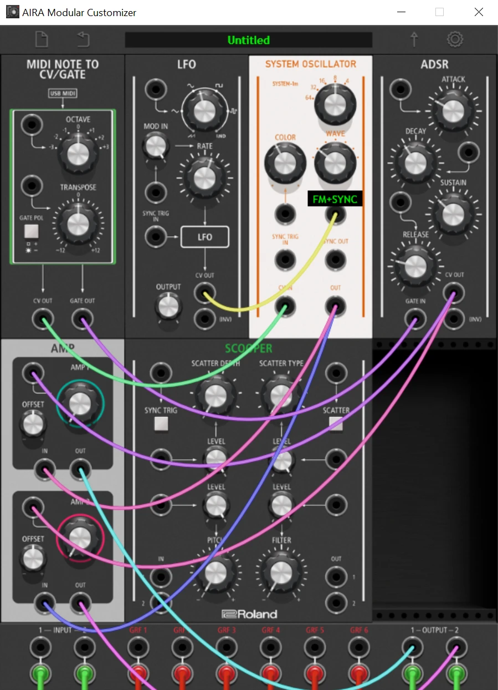

# SYSTEM OSCILLATOR for the Roland AIRA Modular SCOOPER

This custom firmware brings the SYSTEM-1m's oscillator waves to the SCOOPER. In the AIRA Modular Customizer, it takes the place of the FORMANT FILTER module. The wave programs are Roland's own SYSTEM-1m DSP code (firmware 1.30). They're adapted to run on the SCOOPER's DSP, which uses the same chip family.

It's unofficial: not made, endorsed or supported by Roland. Flash at your own risk.



## What you get

- **Seven waves on the WAVE knob:** FM, FM+SYNC, TRI, LOGIC, NOISE SAW, VOWEL and CB (cowbell).
- **Three knobs:** RANGE (64' to 4'), WAVE and COLOR.
- **The same jacks as the stock SAW and SQR oscillators:**

| Jack | What it does |
|---|---|
| CV IN | Pitch, same scale as the stock oscillators. |
| FINE IN | +1.0 raises pitch 1.2 semitones (a tenth of an octave), same as the stock SAW/SQR. |
| COLOR IN | Added to the COLOR knob. +1.0 covers the knob's full range, and the total stays inside that range. |
| SYNC TRIG IN | Each rising edge through 0.3 restarts the wave (hard sync). On CB it strikes the bell. |
| OUT | Audio. |
| SYNC OUT | The SYSTEM saw. Patch it into another oscillator's SYNC TRIG IN to sync that oscillator. |

It's tested on hardware:

- Pitch is exact equal temperament.
- RANGE labels match the stock oscillators.
- FINE IN, COLOR IN and SYNC TRIG IN behave the same as on the stock SQR.

Details are in [docs/hardware-test.md](docs/hardware-test.md).

## CB needs something to hit it

CB is a percussion voice, the SYSTEM-1's 808-style cowbell, not a held tone. It only makes sound when something hits SYNC TRIG IN.

On a SYSTEM-1, each key press hits it internally. The SCOOPER's module has no gate input, so the hit comes in through SYNC TRIG IN.

- Patch MIDINOTE's GATE into SYNC TRIG IN. `VOICE_S1M_CB.bin` is wired this way.
- Any rising edge through 0.3 works: a gate, a clock, an LFO, or another oscillator for metallic buzzes.
- COLOR sets the decay. At 100 it rings for minutes.

**With nothing patched into SYNC TRIG IN, CB is silent.**

## SCOOPER only

One Roland update file (AIRA Modular system program 1.05) serves all four AIRA Modular units: DEMORA, TORCIDO, BITRAZER and SCOOPER. Each unit runs its own part of it. This firmware stores the new wave programs in the space used by the TORCIDO and BITRAZER parts, so on those units it would break their built-in effect. The DEMORA part is untouched, but this firmware has never been tried on a DEMORA. Only flash it on a SCOOPER.

## Install

You need a SCOOPER, the AIRA Modular Customizer (Windows) and Python 3.

1. In the Customizer, load `presets/SAFE_EMPTY.bin` and send it to the unit, so it starts up with an empty patch.
2. Check the firmware hash. It must be `03f4f5f8221092dba6aacaa33c98ba1cc1eddeaf96ae254759388ce5460f51a9`:
   ```
   certutil -hashfile firmware\AIRA_MODULAR_UPD.BIN SHA256
   ```
3. Flash `firmware/AIRA_MODULAR_UPD.BIN` with Roland's normal update procedure.
4. Close the Customizer, then run from this folder:
   ```bash
   python customizer/install_customizer.py
   ```
   The installer backs up everything it replaces and prints the command to undo it. If it doesn't recognise your Customizer version, it stops without changing anything. It also switches on safe patch loading: the Customizer empties the unit before sending a patch, which avoids overload hangs.
5. Open the Customizer. SYSTEM OSCILLATOR is in the module menu where FORMANT FILTER was. Load a preset to start.

## Presets

| File | Patch |
|---|---|
| `VOICE_SYSTEM_TRI.bin` | Simple TRI voice: MIDINOTE → SYSTEM OSC → AMP, with an ADSR. |
| `VOICE_S1M_FM.bin`, `_FMSYNC`, `_LOGIC`, `_NOISESAW`, `_VOWEL` | The same voice on each of the other waves. |
| `VOICE_S1M_CB.bin` | Cowbell, with the gate patched into SYNC TRIG IN. |
| `VOICE_S1M_SYNC_DEMO.bin` | A stock SAW hard-syncs a SYSTEM TRI while the envelope sweeps the TRI's pitch (classic sync sweep). |
| `SAFE_EMPTY.bin` | Empty patch. |

## Experimental: REC/PLAY from a jack (v3.3)

**Not tested on hardware yet.** v3.3 is v3.2 plus one change: a gate on the SCOOPER's **SCATTER control input** works the REC/PLAY button. Some people have done this with a hardware jack mod; this does it in firmware.

- **Short trigger or gate:** a press. The first press records, the next one plays.
- **Held gate:** a hold, which deletes the loop.
- **Synchronised recording:** keep a clock in **SYNC TRIG**. As with the button, recording waits for the next clock pulse.
- **Where it is:** in normal SCOOPER use, the **GRF 6 jack**. In Customizer patches, the jack above the SCATTER button on the SCOOPER module.
- **Trade-off:** that input no longer switches SCATTER. The SCATTER button still does. Everything else is as in v3.2.
- **Converted units:** BITRAZER, DEMORA and TORCIDO hardware has no REC/PLAY button, so on units switched to SCOOPER this is a way to record.

Firmware: `firmware/experimental/v3.3-recplay/AIRA_MODULAR_UPD.BIN`, SHA-256 `4ba0061925a86ba3806a601f58f57da351c7b41e8ed7b7c49ee09c56bfbca139`.

Don't have a gate high on that jack while powering on. The unit could think REC/PLAY is held and open the overdub setting.

How it works and how it was checked: [docs/recplay-jack.md](docs/recplay-jack.md).

## DSP load: stay under about 300

A patch that asks for more DSP than the SCOOPER has will hang it: light-blue LED, and you have to power-cycle. The ceiling is about 300 program records.

| Module | Records |
|---|---:|
| SYSTEM OSC | 94–129 depending on the wave: FM 98, FM+SYNC 124, TRI 99, LOGIC 94, NOISE SAW 129, VOWEL 128, CB 96 |
| ADSR, LFO | 48 each |
| stock SAW | 45 |
| AMP | 19 |
| MIDINOTE | 16 |
| MIXER | 12 |

- One SYSTEM OSC fits in any normal patch.
- Two SYSTEM OSCs plus an ADSR, AMP and MIXER comes to about 302 records, and that hung the unit in testing.
- When you swap a module, the unit counts the old and new ones together for a moment. Empty a slot before putting something heavy in it.

## Known issues

- **Stuck note (seen once, 2026-09-24).** While playing, a note stayed on until the unit was restarted. The cause is unknown and it hasn't been reproduced. If it happens, sending All Notes Off (CC 123) from your controller may clear it without a restart. If you can reproduce it, open an issue saying what you were doing at the time: turning WAVE while holding keys, loading a patch, which wave was selected.
- **A CB that won't stop isn't stuck.** With COLOR near 100 the bell rings for up to several minutes; that's how it's designed. Turn COLOR down, or put an AMP with an envelope after it.

## Going back

1. Flash Roland's official AIRA Modular system program 1.05 (`airamod_sys_v105.zip` from Roland's support site for any AIRA Modular unit).
2. Undo the Customizer change with the command the installer printed:
   ```bash
   python customizer/install_customizer.py --restore "<backup folder>"
   ```

## What's in here

| Folder | Contents |
|---|---|
| `firmware/` | v3.2, the exact image that was flashed and tested. `firmware/experimental/` holds v3.3 (REC/PLAY from a jack), not yet tested on hardware. `SHA256SUMS.txt` lists every file's hash. |
| `presets/` | Customizer patch files. |
| `customizer/` | The six changed Customizer files and the installer. |
| `docs/` | [How it works](docs/how-it-works.md), the [hardware test results](docs/hardware-test.md) and [REC/PLAY from a jack](docs/recplay-jack.md). |
| `evidence/` | Raw JSON from the offline audit, the ARM emulation run and the USB hardware tests. |
| `tools/` | The build and test scripts, as used. See [tools/README.md](tools/README.md). |

## Credits and legal

- The firmware image is Roland's AIRA Modular firmware with modifications, and it contains DSP programs from Roland's SYSTEM-1m firmware. Roland owns that code.
- The files in `customizer/files/` are modified Roland Customizer files.
- Roland, AIRA, SCOOPER, SYSTEM-1, SYSTEM-1m and TR-808 are trademarks of Roland Corporation.
